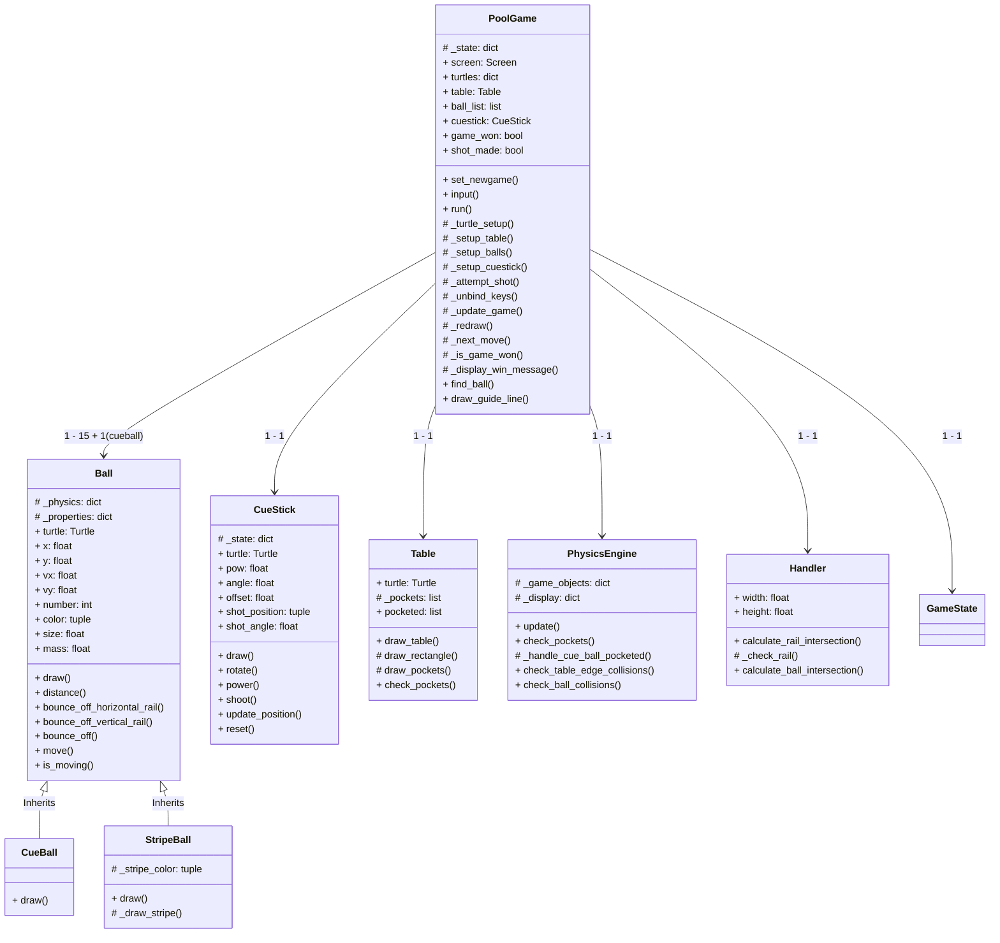

# Pool Game Simulator

---
## Project Description
The **Pool Game Simulator** combines physics simulation with interactive gameplay. Players use a cue stick to strike balls, considering angles, power, and ball interactions. The game features realistic physics including inelastic collisions, friction, and momentum conservation.

### Project Sophistication Level
- **Rating :** `100/100`

### Features:
  - Realistic collision dynamics using coefficient of restitution
  - Accurate friction modeling on the pool table cloth
  - Complex guide line projection calculatiing for ball and rail collisions
  - Dynamic guide line projection for shot aiming
  - Smooth animations and visual feedback

---
## Installation & Setup

### Prerequisites
  Ensure you have the following installed:
- Python 3.8 or higher
- Required libraries: math, random, turtle, tkinter

### Steps
1. **Clone Repository:**
   ```bash
   git clone https://github.com/uzimpp/final_project_y1-1.git poolgame
   ```

2. **Navigate to Project:**
   ```bash
   cd poolgame
   ```

3. **Run Setup Script:**
   ```bash
   python3 src/main.py
   ```

### Game Rules
1. **Basic Rules :**
   - Strike the cue ball to pocket numbered balls
   - Win by pocketing all balls except cue ball
   - Scratch results in cue ball repositioning
2. **That's all:) :**

---
## Controls
- **A / D :** Rotate cue stick (counter-clockwise/clockwise)
- **W / S :** Adjust shot power (increase/decrease)
- ** Space :** Execute shot
- ** Enter :** Restart after winning
- ** Cancel :** Quit after winning

*Provide a link to the demo video here.*

---
## Key Interactions
1. **Shot Execution :**
   - Player adjusts `CueStick` angle and power
   - `CueStick` transfers momentum to `CueBall`
   - `PhysicsEngine` calculates resulting velocities

2. **Collision Handling :**
   - `PhysicsEngine` detects collisions
   - `Handler` calculates intersection points
   - `Ball` objects update their velocities

3. **Game State Management :**
   - `PoolGame` monitors ball positions and velocities
   - `Table` checks for pocketed balls
   - Game state updates based on remaining balls

---
## Technical Highlights

-**Physics Simulation :**
- Inelastic collision calculations
- Momentum conservation
- Friction-based velocity decay
- Rail bounce energy loss

-**Intersection Detection :**
- Ray-circle intersection for ball collisions
- Line-line intersection for rail bounces
- Guide line projection with multiple obstacles

-**State Management :**
- Clean separation of concerns
- Event-driven architecture
- Encapsulated game logic
- Protected attribute access

-**Visual Elements :**
- Smooth cue stick animations
- Dynamic guide line updates
- Realistic ball movement
- Professional-looking table rendering

---
## Physics Implementation

### Physical Properties
Based on [Dr. Dave's Billiards Physics](https://billiards.colostate.edu/faq/physics/physical-properties/):

```python
# Core Constants
BALL_RADIUS = 12px        # 2.25 inches
BALL_MASS = 0.17kg        # 6 oz
SLIDING_FRICTION = 0.2    # Cloth friction
BALL_RESTITUTION = 0.96   # Collision elasticity
```

### Key Physics Concepts

1. **Ball Movement and Friction :**
   - Balls move according to their velocity, which is updated every frame.
   - Friction is applied to simulate the slowing effect of the table cloth, calculated as `F(friction) = μmg`, where `μ` is the friction coefficient, `m` is the ball mass, and `g` is gravity.

2. **Impulse and Momentum :**
   - Impulse is the change in momentum of an object when a force is applied over time. It is calculated as the product of force and time duration: 
	`J = F \times \Delta t`
   - In the game, impulse is used to determine the change in velocity of balls when struck by the cue stick or during collisions.

3. **Collision Dynamics :**
   - **Inelastic Collisions:** When balls collide, their velocities are updated using the coefficient of restitution `(e ≈ 0.96)`, ensuring energy conservation.
   - **Rail Bounces:** Balls bounce off table edges with some energy loss, modeled by a lower restitution coefficient for rail collisions. `(e ≈ 0.75)`

4. **Coefficient of Restitution (COR) :**
   - The coefficient of restitution (COR or e) is a measure of how "bouncy" a collision is. It indicates the amount of energy retained after two objects collide. A COR of 1 signifies a perfectly elastic collision with no energy loss, while a COR of 0 indicates a completely inelastic collision where all energy is lost.
   - In this pool game simulation, the COR is used to calculate the impulse during a collision, which is the change in momentum. This impulse is applied to both balls involved in the collision to adjust their velocities. For pool balls, the COR is approximately 0.96, reflecting the slight energy loss typical in real-world pool games.

5. **Pocket Detection :**
   - Balls are checked for proximity to pockets. If a ball is close enough, it is considered pocketed and removed from play.
   - The cue ball is repositioned if pocketed, simulating a scratch.

6. **Cue Stick Mechanics :**
   - The cue stick's angle and power are adjustable, affecting the direction and speed of the cue ball.
   - The shot power determines the velocity imparted to the cue ball, with a maximum speed limit to ensure realistic gameplay.

7. **Table Dimensions :**
   - Length: 9ft (900px)
   - Width: 4.5ft (450px)
   - Scale: 1ft = 100px

---

## Project Architecture

### File Structure
```
/
├── src/
│   ├── poolgame.py     # Main controller
│   ├── ball.py        # Ball physics
│   ├── cuestick.py    # Cue mechanics
│   ├── table.py       # Table handling
│   ├── physic.py      # Physics engine
│   ├── handler.py     # Collision detection
│   ├── config.py      # Constants
│   └── display.py     # Display management
├── README.md
└── 8 pool game.png
```

### Core Components
- **`PoolGame`:** 
  - Main game controller managing game states and user interactions
  - Handles game loop, input processing, and display updates
  - Coordinates interactions between all other components

- **`Ball` Family:** 
  - Base class implementing physics-based ball behavior
  - `CueBall`: Special white ball that players strike directly
  - `StripeBall`: Implements striped ball visuals (numbers 9-15)
  - Handles movement, collisions, and visual rendering

- **`CueStick`:** 
  - Manages cue stick positioning, power, and shooting mechanics
  - Provides visual feedback for aiming and power
  - Handles shot execution and animation

- **`Table`:** 
  - Renders the pool table surface and pockets
  - Manages pocket collision detection
  - Tracks pocketed balls and handles ball removal

- **`PhysicsEngine`:** 
  - Implements core physics calculations:
    - Ball-to-ball collisions using coefficient of restitution
    - Rail bounces with energy loss
    - Friction and velocity calculations
  - Updates ball positions and velocities

- **`Handler`:** 
  - Manages intersection calculations for:
    - Ball-to-rail collisions
    - Ball-to-ball collisions
    - Guide line projections
  - Provides utility functions for collision detection


### UML Class Diagram

---

## Testing & Quality
- Fully compliant with Pylint
- Check code quality:
```bash
pylint src/*.py
```

### Further Improvements
---

## Contributing
1. Fork repository
2. Create feature branch
3. Commit changes
4. Open pull request

---

## License
MIT License - See LICENSE file for details
